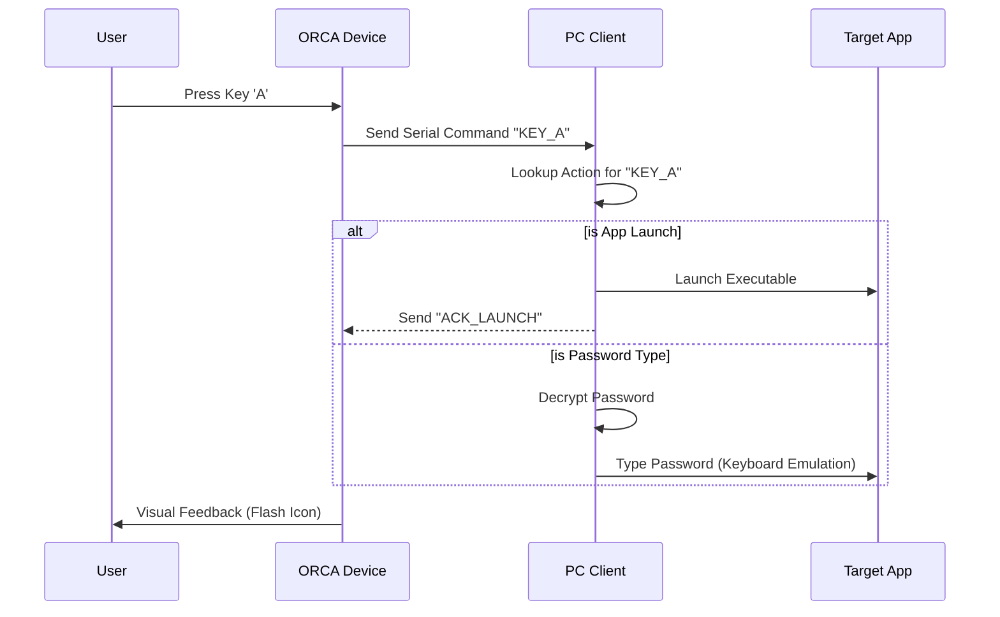

<div align="center">

# 🐋 ORCA DECK
### The Ultimate RFID-Based Password Manager & PC Controller

[](https://python.org)
[](https://microsoft.com)
[](https://espressif.com)
[]()
[](LICENSE)

[**Explore the docs »**](#)
<br />
[View Demo](#)
·
[Report Bug](#)
·
[Request Feature](#)

</div>

---

## 📑 Table of Contents
1. [Overview](#-overview)
2. [Why ORCA DECK?](#-why-orca-deck)
3. [Features](#-features)
4. [Architecture](#-architecture)
5. [Hardware & Wiring](#-hardware--wiring)
6. [Installation](#-installation)
7. [Usage](#-usage)
8. [Screenshots](#-screenshots)
9. [Contributing](#-contributing)
10. [License](#-license)

---

## 🌊 Overview

**ORCA DECK** is a powerful, open-source hardware interface designed to bridge the gap between physical security and digital convenience. It combines **application launching**, **password management**, and **physical security** into a single, sleek device powered by an **ESP32** microcontroller and a **Python PC client**.

Unlike standard macro pads, ORCA DECK features a **built-in RFID reader** and **encrypted password storage**, making it a security key for your digital life. Launch apps, type complex passwords instantly, and lock/unlock your PC with a physical tag—all from one device.

---

## ⚖️ Why ORCA DECK?

| Feature | 🐋 ORCA DECK | 🎹 Elgato Stream Deck | 🔑 YubiKey |
| :--- | :---: | :---: | :---: |
| **Price** | **Low (DIY)** | High ($150+) | Medium ($50+) |
| **App Launching** | ✅ | ✅ | ❌ |
| **Password Typing** | ✅ (Encrypted) | ❌ (Plugins only) | ✅ |
| **RFID Unlocking** | ✅ **Built-in** | ❌ | ⚠️ (NFC Versions) |
| **PC Locking** | ✅ | ❌ | ❌ |
| **Offline Storage** | ✅ (SPIFFS) | ❌ | ✅ |
| **Open Source** | ✅ | ❌ | ⚠️ |

---

## 🚀 Features

### 🛡️ Security & Privacy
*   **RFID System Lock/Unlock**: Use a physical NFC tag/card to unlock your PC or access the password manager.
*   **AES Encryption**: All passwords are stored using high-grade `AES` encryption via `pycryptodome`.
*   **Zero-Latency Storage**: Credentials are stored securely on the device's flash memory (SPIFFS)—no SD cards required.
*   **Emergency Recovery**: Secure Q&A fallback in case of lost cards.

### ⚡ Productivity
*   **Instant App Launcher**: Map physical keys to launch your favorite applications (Discord, VS Code, Browser, etc.).
*   **Macro Support**: Execute complex key combinations with a single press.
*   **Clipboard Manager**: (Planned) History of clipboard items.

### 🖥️ Hardware Integration
*   **Dynamic Icon Sync**: Upload icons from your PC directly to the device's ILI9341 display.
*   **Real-time Feedback**: Visual feedback on the TFT screen when keys are pressed or apps are launched.
*   **System Tray App**: The Python client runs quietly in the background (`pystray`).

---

## 🏗️ Architecture

The system uses a bidirectional Serial protocol to communicate between the PC Client (Brain) and the ESP32 (Body).

```mermaid
graph TD
    subgraph Hardware [Physical Device (ESP32)]
        A[Keypad 4x4] -->|Keypress| B[ESP32 Core]
        C[RFID PN532] -->|Tag Scan| B
        B -->|Display UI| D[TFT ILI9341]
        E[SPIFFS Storage] <-->|Read/Write Icons| B
    end

    subgraph PC [Computer (Windows)]
        F[Serial Handler] <-->|USB Serial| B
        G[OrcaApp Logic] <--> F
        H[Encryption Manager] <--> G
        I[App Launcher] <--> G
        J[Vault DB] <--> H
    end

    G -->|Type Text| K[PyAutoGUI/PyPerclip]
    G -->|Lock/Unlock| L[Windows API]
```

---

## 🔧 Hardware & Wiring

To build your own ORCA DECK, you will need the following components and wiring configuration:

| Component | Description |
| :--- | :--- |
| **Microcontroller** | ESP32 Development Board (CP210x Drivers) |
| **Display** | 2.4" or 2.8" TFT SPI Display (ILI9341) |
| **Input** | 4x4 Matrix Membrane Keypad |
| **NFC/RFID** | PN532 NFC Module (V3) or RC522 |
| **Case** | 3D Printed Enclosure |

### 🔌 Wiring Guide

**RFID Module (SPI)**
*   **SDA**: GPIO 21
*   **SCK**: GPIO 18
*   **MOSI**: GPIO 23
*   **MISO**: GPIO 19

*(Connect other components as per `docs/wiring.md`)*

---

## 📦 Installation

### Prerequisites
*   Windows 10/11
*   Python 3.10+
*   Arduino IDE (for flashing firmware)

### 1. Python Client Setup
```bash
# Clone the repository
git clone https://github.com/Muhib-Mehdi/O.R.C.A.-DECK.git
cd orca-deck

# Install dependencies
pip install -r requirements.txt
```

### 2. Hardware Firmware Setup
1.  Open `sketch_oct16a/sketch_oct16a.ino` in Arduino IDE.
2.  Install the following libraries via Library Manager:
    *   `Adafruit GFX`, `Adafruit ILI9341`, `Keypad`, `Adafruit PN532`
3.  Select your ESP32 board and port.
4.  **Upload** the sketch.

---

## 💡 Usage

### Starting the App
Run the main python script to start the client:
```bash
python "PC client/orca_deck_app.py"
```

### Workflow



1.  **Dashboard**: The main window allows you to configure keys.
2.  **RFID Setup**: Go to Settings > "Add New Card" and scan your tag to register it as a Master Key.
3.  **App Mapping**: Click a slot to assign an `.exe` or application alias.
4.  **Password Vault**: Add credentials and map them to physical keys.

---

## 📸 Screenshots

### 🖥️ The Hardware
*Custom-built PCB with ESP32, TFT Display, and RFID Reader.*


### 📟 The Interface
*Clean, futuristic menu running on the embedded display.*


---

## 🤝 Contributing

Contributions are what make the open source community such an amazing place to learn, inspire, and create. Any contributions you make are **greatly appreciated**.

1.  Fork the Project
2.  Create your Feature Branch (`git checkout -b feature/AmazingFeature`)
3.  Commit your Changes (`git commit -m 'Add some AmazingFeature'`)
4.  Push to the Branch (`git push origin feature/AmazingFeature`)
5.  Open a Pull Request

---

## 📞 License & Contact

Distributed under the MIT License. See `LICENSE` for more information.

**Project Link:** [https://github.com/Muhib-Mehdi/O.R.C.A.-DECK](https://github.com/Muhib-Mehdi/O.R.C.A.-DECK)

[](https://www.linkedin.com/in/muhib-mehdi)
[](#)
